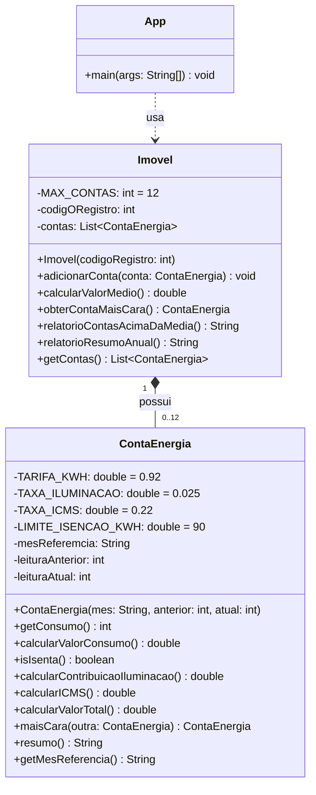

#Trabalho de Implementação 01 - POO
Análise e Desenvolvimento de Sistemas - IFTO

#Diagrama de Classes UML

```mermaid
classDiagram 
    class App {
        +main(args: String[]) void
    }
    class Imovel {
        -MAX_CONTAS: int = 12
        -codigORegistro: int
        -contas: List~ContaEnergia~
        +Imovel(codigoRegistro: int)
        +adicionarConta(conta: ContaEnergia) void
        +calcularValorMedio() double 
        +obterContaMaisCara() ContaEnergia
        +relatorioContasAcimaDaMedia() String
        +relatorioResumoAnual() String
        +getContas() List~ContaEnergia~
    }

    class ContaEnergia {
        -TARIFA_KWH: double = 0.92
        -TAXA_ILUMINACAO: double = 0.025
        -TAXA_ICMS: double = 0.22
        -LIMITE_ISENCAO_KWH: double = 90
        -mesReferemcia: String
        -leituraAnterior: int
        -leituraAtual: int
        +ContaEnergia(mes: String, anterior: int, atual: int)
        +getConsumo() int
        +calcularValorConsumo() double
        +isIsenta() boolean
        +calcularContribuicaoIluminacao() double
        +calcularICMS() double
        +calcularValorTotal() double
        +maisCara(outra: ContaEnergia) ContaEnergia
        +resumo() String 
        +getMesReferencia() String
    }
    Imovel "1" *-- "0..12" ContaEnergia : possui
    App ..> Imovel : usa
```    